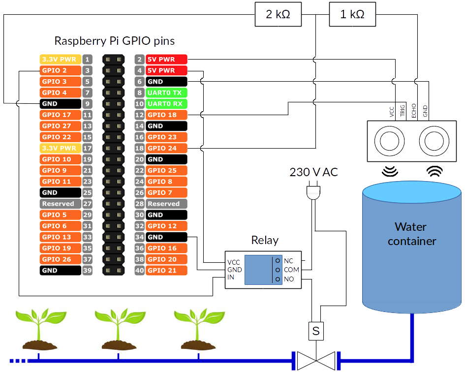

<p align="center">
   
</p>
<h1 align="center">Open Pluie</h1>

Homemade irrigation system with a Raspberry Pi. Two modes:
<ol>
   <li> On demand watering via a web interface.
   <li> Custom regular watering with a <a href="https://en.wikipedia.org/wiki/Cron">cron</a> job.
</ol>


**Remark**: This project is supposed to be run on a Raspberry Pi. On a standard computer, you can still run a [demo](#standard-computer) of the web interface.


**Table of contents**

- [Installation](#Installation)
   - [Basic installation](#basic-installation)
   - [MySQL server](#mysql-server)
   - [Secret key for authentication](#secret-key-for-authentication)
- [Irrigation system](#irrigation-system)
  - [Main hardware components](#main-hardware-components)
  - [Schema of the whole system](#schema-of-the-whole-system)
  - [Pin configuration](#pin-configuration)
- [Option 1: on demand watering via a web interface](#option-2-on-demand-watering-via-a-web-interface)
  - [Options](#options)
  - [Hosting the website](#hosting-the-website)
  - [Raspberry Pi](#raspberry-pi)
  - [Standard computer](#standard-computer)
- [Option 2: custom regular watering with a cron job](#option-1-custom-regular-watering-with-a-cron-job)
- [Access the GPIO pins without root](#access-the-gpio-pins-without-root)

## Installation

### Basic installation

**Note**: The basic installation is sufficient to run the second option (regular watering with a cron job, detailed [here](#option-2-custom-regular-watering-with-a-cron-job)).

Clone the project in your current location, and navigate to it:
```bash
git clone https://github.com/bloodymosquito/open-pluie.git
cd open-pluie
```

This project use python3 with the libraries listed in [requirements.txt](./requirements.txt).

For instance, you may create a python3 virtual environment with [virtualenv](https://pypi.org/project/virtualenv/):
```bash
virtualenv -p python3 ~/.virtualenvs/openpluie
source ~/.virtualenvs/openpluie/bin/activate
pip install -r requirements.txt
```

**Note**: For the first option (on demand watering via a web interface), you also need the following steps.


### MySQL server

To run the web server, you need [MySQL](https://dev.mysql.com/doc/refman/8.0/en/installing.html). [Here](https://support.rackspace.com/how-to/installing-mysql-server-on-ubuntu/) is a tutorial to install it on Ubuntu.

Then, setup a MySQL database for the openpluie web server:
```bash
python mysql_setup.py
```

It creates a MySQL user called `admin_openpluie`, a database called `openpluie`, containing a table `users` containing the `admin` user for the website.

### Secret key for authentication

The web server use a secret key for authentication and security. Create the text file `./config/cookie.secret`, and write a long random sequence of characters on the first line.


## Irrigation system

### Main hardware components

- A [Raspberry Pi](https://www.raspberrypi.org/).
- A [solenoid valve](https://www.amazon.com/d/Electronic-Drums/2W-200-20-AC220V-4inch-Electric-Solenoid/B073LS9QPX).
- A [relay module](https://www.amazon.com/JBtek-Channel-Module-Arduino-Raspberry/dp/B00KTELP3I?ref_=fsclp_pl_dp_1).
- An [ultrasonic sensor](https://www.amazon.com/SainSmart-HC-SR04-Ranging-Detector-Distance/dp/B004U8TOE6/ref=sr_1_5?keywords=hcsr04&qid=1556912786&s=gateway&sr=8-5).
- Two resistors (1000 and 2000 ohms): we use a voltage divider to reduce the ultrasonic sensor's 5V output to 3.3V (for the Raspberry Pi).
- A water container, filled with rainwater.
- Drip irrigation material.

### Schema of the whole system

<p align="center">
   
   <br/>
</p>

### Pin configuration

In the file [`config/pins.json`](./config/pins.json), report the GPIO pins you used for:
- The *trigger* pin of the ultrasonic sensor (here GPIO18).
- The *echo* pin of the ultrasonic sensor (here GPIO24).
- The *IN* pin of each relay (here GPIO2).

If you have a module with multiple relays, you can build several independent irrigation circuits. Here is an example of `config/pins.json` with eight relays:

```json
{
    "relay":
    {
        "1": 2,
        "2": 3,
        "3": 4,
        "4": 17,
        "5": 27,
        "6": 22,
        "7": 10,
        "8": 9
    },
    "trigger": 18,
    "echo": 24
}
```

## Option 1: on demand watering via a web interface

To run the web interface, type:

```bash
python server.py
```

It will prompt for the password of the MySQL `admin_openpluie` user, that you defined when using the `mysql_setup.py` script in [MySQL server](#mysql-server) section.

In your browser, type `localhost:9080` to access the website.

For the first time, enter the user `admin` with the password you defined when using the `mysql_setup.py` script.

Once logged in, you can resort to the `create user` section to add a new user to the database.

### Options

- You can specify the dimensions of your (cylindrical) water container with the options `--height` and `--diameter`.
- You can change the port with the `--port` option.

Type `python server.py -h` to see all the options.

### Hosting the website

You can then do port forwarding on your router to host the website on your Raspberry Pi and make it accessible from the internet.

### Raspberry Pi

When running this script on a Raspberry Pi:

- The slider `Watering circuit n°1` button will change the state of the relay to start / stop watering.
- The `measure` button will measure the remaining volume of water in the container.

### Standard computer

To run a demo of the web interface on a computer, type `python server.py`. As there is no GPIO pins, the behaviour is simulated. In particular:

- The slider `Watering circuit n°1` button will move but does nothing concrete.
- The `measure` button will provide random values.

## Option 2: custom regular watering with a cron job

If your Raspberry Pi doesn't have access to the internet, or if you want to automate the watering, you can use the script `cron.py`, with the job scheduler of your OS, for instance <a href="https://en.wikipedia.org/wiki/Cron">cron</a> for Unix-like systems.

Type `crontab -e` to edit the cron jobs.

A line in crontab looks like: `* * * * * command to execute`

With the five stars corresponding to:

1. minute (0 - 59)
2. hour (0 - 23)
3. day of the month (1 - 31)
4. month (1 - 12)
5. day of the week (0 - 6)

For instance, to do watering every night at 1 a.m., type:

`0 1 * * * ~/.virtualenvs/openpluie/bin/python /path/to/openpluie/cron.py`

You can add optional arguments (described below) in this line too.

**Options**

- You can specify the number of liters to use with the `--liters` argument (default: 5).
- If it rained (positive variation of the container volume), then this script won't do watering. You can specify the threshold of detection of a rain (in liters) with the `--rain_volume` argument.
- There is a limit duration of watering for security, you can modify it via the `--time_limit` argument.

Type `python cron.py -h` to see all the options.


## Access the GPIO pins without root

On a Rapsberry Pi, the scripts `server.py` and `cron.py` should be run as root to access the GPIO pins. You can change it as explained in [this discussion](https://raspberrypi.stackexchange.com/questions/40105/access-gpio-pins-without-root-no-access-to-dev-mem-try-running-as-root/46235).
